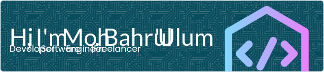

## Hi, I'm Moh. Bahrul 'Ulum 👋

<!--
**ulumdev/ulumdev** is a ✨ _special_ ✨ repository because its `README.md` (this file) appears on your GitHub profile.

Here are some ideas to get you started:

- 🔭 I’m currently working on ...
- 🌱 I’m currently learning ...
- 👯 I’m looking to collaborate on ...
- 🤔 I’m looking for help with ...
- 💬 Ask me about ...
- 📫 How to reach me: ...
- 😄 Pronouns: ...
- ⚡ Fun fact: ...
-->

- 🧛 I have expertise in **Mobile & Web** Development
- 🌱 I’m currently learning **Flutter & Laravel** Framework
- 🤔 I’m looking for help with **Stack Overflow & Programmer Forums**
- 📫 You can reach me at **belajarkoding97@gmail.com**

##### Skills

<!-- 

 -->

 

<!-- 

 -->

 

 

<!-- 
 -->

<!--  
 -->

##### Connect with Me

  

##### My GitHub Stats

<!--   -->

